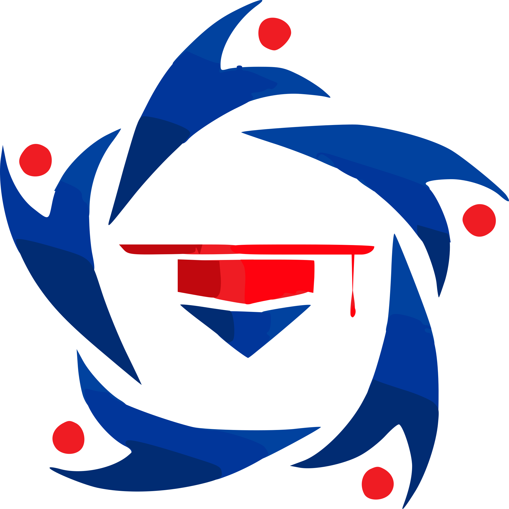

<p align="center">
  
</p>

<h1 align="center">GenBI Jatim — Platform Digital</h1>

<p align="center">
  Platform web resmi Generasi Baru Indonesia (GenBI) Koordinator Komisariat Jawa Timur.
  <br />
  Dibangun sebagai monorepo modern dengan <strong>Next.js 16</strong>, <strong>Express.js</strong>, dan <strong>TypeScript</strong>.
</p>

<p align="center">
  
  
  
  
  
</p>

---

## 📋 Daftar Isi

- [Tentang Proyek](#-tentang-proyek)
- [Arsitektur & Struktur Proyek](#-arsitektur--struktur-proyek)
- [Tech Stack](#-tech-stack)
- [Prasyarat](#-prasyarat)
- [Instalasi & Setup](#-instalasi--setup)
- [Menjalankan Development Server](#-menjalankan-development-server)
- [Build untuk Production](#-build-untuk-production)
- [Struktur Halaman (Routes)](#-struktur-halaman-routes)
- [Panduan Pengembangan](#-panduan-pengembangan)
- [Konvensi Kode](#-konvensi-kode)
- [Catatan & Perbaikan yang Diperlukan](#-catatan--perbaikan-yang-diperlukan)
- [Roadmap Pengembangan](#-roadmap-pengembangan)
- [Kontribusi](#-kontribusi)
- [Lisensi](#-lisensi)

---

## 🏛 Tentang Proyek

GenBI Jatim Digital Platform adalah website resmi yang berfungsi sebagai:

- **Pusat Informasi**: Berita, kalender kegiatan, dan profil organisasi.
- **Database Komisariat**: Profil 9 komisariat kampus mitra BI Jawa Timur.
- **Database Awardee**: Data penerima beasiswa Bank Indonesia.
- **Pusat Dokumen**: SOP, template surat, dan logo.
- **Portal Admin**: Dashboard pengelolaan konten (dalam pengembangan).

---

## 🏗 Arsitektur & Struktur Proyek

Proyek ini menggunakan arsitektur **Turborepo Monorepo** dengan pembagian concern yang jelas:

```
genbi-jatim-monorepo/
├── apps/
│   ├── web/                     # Frontend — Next.js 16 (App Router)
│   │   ├── app/                 # Route pages (Server Components)
│   │   │   ├── about/           # Halaman Tentang Kami
│   │   │   ├── admin/           # Halaman Admin
│   │   │   ├── awardee/         # Database Penerima Beasiswa
│   │   │   ├── calendar/        # Kalender Kegiatan
│   │   │   ├── commissariat/    # Profil Komisariat
│   │   │   ├── contact/         # Hubungi Kami
│   │   │   ├── docs/            # Pusat Dokumen
│   │   │   ├── news/            # Berita & Kegiatan
│   │   │   ├── program/         # Detail Program Kerja
│   │   │   ├── layout.tsx       # Root Layout
│   │   │   ├── loading.tsx      # Global Loading Skeleton
│   │   │   ├── error.tsx        # Global Error Boundary
│   │   │   └── not-found.tsx    # Custom 404
│   │   ├── components/          # Reusable UI Components
│   │   │   ├── layout/navbar/   # Navbar (Logo, NavLinks, MobileMenu)
│   │   │   ├── features/        # Feature-specific components
│   │   │   └── *.tsx            # Shared components (Button, Card, dll.)
│   │   ├── content/             # Static content & mock data
│   │   ├── config/              # Site configuration (navigation, dll.)
│   │   ├── lib/                 # Utilities & Service Layer
│   │   │   ├── services/        # Data fetching services
│   │   │   ├── api.ts           # Axios API client
│   │   │   └── utils.ts         # Helper functions (cn, dll.)
│   │   └── actions/             # Server Actions (contact form)
│   │
│   └── api/                     # Backend — Express.js
│       └── src/
│           ├── server.ts        # Entry point
│           └── routes/          # API route handlers
│               ├── news.ts
│               ├── docs.ts
│               ├── profile.ts
│               └── events.ts
│
├── packages/
│   └── types/                   # Shared TypeScript types
│       └── src/index.ts         # Interface definitions (NewsItem, EventItem, dll.)
│
├── turbo.json                   # Turborepo pipeline config
├── tsconfig.json                # Root TypeScript config
└── package.json                 # Root workspace config
```

### Alur Data (Data Flow)

```
┌─────────────────┐     ┌─────────────────┐     ┌──────────────────┐
│   Next.js Page   │────▶│  Service Layer   │────▶│   Axios Client   │
│ (Server Comp.)   │     │ (lib/services/)  │     │   (lib/api.ts)   │
└─────────────────┘     └─────────────────┘     └────────┬─────────┘
                                                         │
                                                         ▼
┌─────────────────┐     ┌─────────────────┐     ┌──────────────────┐
│  Client Comp.    │◀────│  Props / Data    │◀────│  Express API     │
│ (interaktif)     │     │                  │     │  (apps/api)      │
└─────────────────┘     └─────────────────┘     └──────────────────┘
```

> **Catatan:** Saat ini beberapa service masih menggunakan data dari `content/` (mock data). Ketika backend API sudah fully production-ready, semua service akan fetch dari API.

---

## 🧱 Tech Stack

| Layer          | Teknologi            | Versi  |
| -------------- | -------------------- | ------ |
| **Frontend**   | Next.js (App Router) | 16.1.0 |
| **UI**         | React                | 19.2   |
| **Styling**    | Tailwind CSS         | 4.x    |
| **Animation**  | Framer Motion        | 12.x   |
| **Icons**      | Lucide React         | 0.562  |
| **Backend**    | Express.js           | 4.19   |
| **Language**   | TypeScript           | 5.x    |
| **Validation** | Zod                  | 4.x    |
| **HTTP**       | Axios                | 1.6    |
| **Monorepo**   | Turborepo            | latest |
| **Package**    | npm Workspaces       | 10.x   |

---

## ✅ Prasyarat

Pastikan tools berikut sudah terinstal di mesin Anda:

- **Node.js** ≥ 18.x → [Download](https://nodejs.org/)
- **npm** ≥ 10.x (biasanya bundled dengan Node.js)
- **Git** → [Download](https://git-scm.com/)

---

## 🚀 Instalasi & Setup

### 1. Clone Repository

```bash
git clone git clone https://github.com/Efaii/WebsiteGenBIJatim.git
cd WebsiteGenBIJatim
```

### 2. Install Dependencies

Dari **root** project (cukup sekali, npm workspaces akan handle semua):

```bash
npm install
```

### 3. Setup Environment Variables

Buat file `.env.local` di `apps/web/`:

```bash
# apps/web/.env.local
NEXT_PUBLIC_API_URL=http://localhost:3001
```

Buat file `.env` di `apps/api/` (opsional):

```bash
# apps/api/.env
PORT=3001
```

---

## 💻 Menjalankan Development Server

### Menjalankan Semua Apps Sekaligus (Recommended)

```bash
# Dari root project
npm run dev
```

Ini akan menjalankan:

- **Web** → `http://localhost:3000`
- **API** → `http://localhost:3001`

### Menjalankan Satu App Saja

```bash
# Frontend saja
cd apps/web
npm run dev

# Backend saja
cd apps/api
npm run dev
```

---

## 📦 Build untuk Production

```bash
# Build semua apps & packages
npm run build
```

Build output:

- **Web**: `apps/web/.next/` (Next.js optimized build)
- **API**: `apps/api/dist/` (compiled JS)

### Production Start

```bash
# Web
cd apps/web && npm run start

# API
cd apps/api && npm run start
```

---

## 🗺 Struktur Halaman (Routes)

| Route                  | Tipe    | Deskripsi                           |
| ---------------------- | ------- | ----------------------------------- |
| `/`                    | Static  | Landing page utama                  |
| `/about`               | Static  | Profil organisasi, visi misi        |
| `/commissariat`        | Static  | Daftar semua komisariat             |
| `/commissariat/[slug]` | SSG     | Detail komisariat (9 kampus)        |
| `/calendar`            | Static  | Kalender kegiatan                   |
| `/calendar/[id]`       | SSG     | Detail event                        |
| `/news`                | Static  | Daftar berita                       |
| `/news/[slug]`         | Dynamic | Detail berita                       |
| `/docs`                | Static  | Pusat dokumen (SOP, template, dll.) |
| `/awardee`             | Static  | Database penerima beasiswa          |
| `/contact`             | Static  | Form kontak (Server Action)         |
| `/program/[id]`        | SSG     | Detail program kerja                |
| `/admin`               | Dynamic | Admin konten (beranda, berita, FAQ); login admin global |

**Keterangan Tipe:**

- **Static**: Pre-rendered saat build, tidak berubah.
- **SSG**: Static Generation dengan `generateStaticParams`, halaman di-generate per-item.
- **Dynamic**: Server-rendered on-demand per request.

---

## 📖 Panduan Pengembangan

### Menambah Halaman Baru

1. Buat folder baru di `apps/web/app/nama-halaman/`
2. Buat `page.tsx` sebagai **Server Component** (tanpa `"use client"`)
3. Jika butuh interaktivitas, buat Client Component terpisah di `components/`

```tsx
// apps/web/app/my-page/page.tsx (Server Component)
import { MyClientWidget } from "@/components/features/my-page/MyClientWidget";

export default async function MyPage() {
  const data = await fetchData(); // Server-side fetch
  return (
    <main>
      <h1>Static Title</h1>
      <MyClientWidget data={data} /> {/* Interaktif → Client Component */}
    </main>
  );
}
```

### Menambah Service Baru

1. Buat file di `apps/web/lib/services/nama.service.ts`
2. Import Axios client dari `@/lib/api`
3. Definisikan type di `packages/types/src/index.ts`

```tsx
// apps/web/lib/services/example.service.ts
import api from "@/lib/api";
import { ExampleItem } from "@/app/types";

export const getAll = async (): Promise<ExampleItem[]> => {
  const response = await api.get<ExampleItem[]>("/examples");
  return response.data;
};
```

### Menambah API Endpoint Baru

1. Buat file di `apps/api/src/routes/nama.ts`
2. Register route di `apps/api/src/server.ts`

```tsx
// apps/api/src/routes/example.ts
import { Router } from "express";
const router = Router();

router.get("/", (req, res) => {
  res.json([{ id: 1, name: "Test" }]);
});

export default router;
```

```tsx
// apps/api/src/server.ts
import exampleRoutes from "./routes/example";
app.use("/examples", exampleRoutes);
```

### Menambah Shared Type

Edit `packages/types/src/index.ts`, lalu rebuild:

```bash
cd packages/types && npm run build
```

---

## 📏 Konvensi Kode

### Naming Conventions

| Item            | Convention | Contoh                  |
| --------------- | ---------- | ----------------------- |
| Component files | PascalCase | `ContactForm.tsx`       |
| Page files      | `page.tsx` | `app/about/page.tsx`    |
| Service files   | kebab-case | `calendar.service.ts`   |
| Type/Interface  | PascalCase | `NewsItem`, `EventItem` |
| Content files   | camelCase  | `commissariatData.ts`   |
| Config files    | camelCase  | `site.ts`               |

### Aturan Penting

1. **Server Component by default** — Jangan tambahkan `"use client"` kecuali benar-benar butuh interaktivitas (state, event handler, `useEffect`).
2. **Data fetching di Server** — Selalu fetch data di `page.tsx` (Server Component), lalu pass sebagai props ke Client Component.
3. **Content ≠ Code** — Teks statis dan data mock disimpan di `content/`, bukan dihardcode di komponen.
4. **Shared types** — Semua interface yang digunakan frontend & backend harus didefinisikan di `packages/types`.
5. **Server Actions** — Untuk form submission, gunakan Server Actions (`actions/`) dengan validasi Zod, bukan `useState` + `fetch`.

### Struktur Komponen

```
components/
├── layout/         # Layout components (Navbar, Footer wrapper)
│   └── navbar/     # Atomic navbar parts (Logo, NavLinks, MobileMenu)
├── features/       # Feature-specific components
│   └── contact/    # ContactForm.tsx
├── Button.tsx      # Shared UI primitives
├── Card.tsx
└── ...
```

---

## ⚠️ Catatan & Perbaikan yang Diperlukan

### 🔴 Kritis (Harus Segera Diperbaiki)

| #   | Issue                                           | File                                   | Keterangan                                                                                                                                               |
| --- | ----------------------------------------------- | -------------------------------------- | -------------------------------------------------------------------------------------------------------------------------------------------------------- |
| 1   | **`news/[slug]/page.tsx` masih `"use client"`** | `app/news/[slug]/page.tsx`             | Seluruh halaman detail berita menggunakan CSR dengan data hardcoded sebagai JSX. Harus di-refactor menjadi Server Component + Client Component terpisah. |
| 2   | **Mock data di beberapa service**               | `lib/services/commissariat.service.ts` | Menggunakan `setTimeout` untuk simulasi latency. Harus diganti dengan real API call saat backend ready.                                                  |
| 3   | **Backend API masih mock**                      | `apps/api/src/routes/*.ts`             | Semua endpoint return hardcoded data. Belum terhubung ke database.                                                                                       |

### 🟡 Sedang (Perlu Diperbaiki)

| #   | Issue                                 | File                       | Keterangan                                                                                                                                             |
| --- | ------------------------------------- | -------------------------- | ------------------------------------------------------------------------------------------------------------------------------------------------------ |
| 5   | **Tidak ada testing**                 | —                          | Belum ada unit test, integration test, maupun E2E test.                                                                                                |
| 6   | **SEO belum menyeluruh**              | `app/news/[slug]/page.tsx` | `generateMetadata` baru ada di `commissariat/[slug]`. Halaman `news/[slug]`, `calendar/[id]`, dan `program/[id]` belum punya.                          |
| 7   | **`page.tsx` (Home) masih monolitik** | `app/page.tsx`             | 478 baris, perlu dipecah menjadi section-components terpisah (HeroSection, StatsSection, dll.). Gunakan data dari `content/home.ts` yang sudah dibuat. |
| 8   | **Environment variable hardcoded**    | `lib/api.ts`               | Fallback API URL hardcoded ke `localhost:3001`. Perlu validasi env di startup.                                                                         |

### 🟢 Minor (Nice to Have)

| #   | Issue                      | Keterangan                                                                                    |
| --- | -------------------------- | --------------------------------------------------------------------------------------------- |
| 9   | **Image optimization**     | Beberapa gambar belum menggunakan `next/image` secara optimal (sizes, priority, placeholder). |
| 10  | **Accessibility (a11y)**   | Belum ada audit aksesibilitas. Perlu `aria-label`, focus management, keyboard navigation.     |
| 11  | **Dark/Light mode toggle** | Saat ini hanya dark mode, tidak ada opsi switch.                                              |
| 12  | **CI/CD pipeline**         | Belum ada GitHub Actions untuk automated build, lint, dan deploy.                             |

---

## 🗺 Roadmap Pengembangan

### 🏁 Phase 1 — Foundation (✅ Selesai)

- [x] Setup monorepo (Turborepo + npm workspaces)
- [x] Frontend Next.js dengan App Router
- [x] Backend Express.js skeleton
- [x] Shared types package (`@repo/types`)
- [x] Service layer + Axios client
- [x] UX guardrails (`loading`, `error`, `not-found`)
- [x] Server Actions (Contact Form + Zod)
- [x] Navbar decomposition (atomic components)
- [x] Content externalization (`app/data/` → `content/`)

### 🚧 Phase 2 — Backend & Database

- [ ] Pilih dan setup database (PostgreSQL / MySQL / MongoDB)
- [ ] Buat ORM/ODM layer (Prisma / Drizzle / Mongoose)
- [ ] Migrasi mock data ke database
- [ ] Implementasi CRUD API yang proper (error handling, pagination)
- [ ] Ganti `setTimeout` di service dengan real API calls
- [ ] Setup authentication (JWT / NextAuth.js)

### 🔮 Phase 3 — Production Hardening

- [ ] Refactor `news/[slug]/page.tsx` ke Server Component
- [ ] Refactor `page.tsx` (Home) menjadi section components
- [ ] Tambahkan `generateMetadata` ke semua dynamic pages
- [ ] Setup CI/CD (GitHub Actions: lint → test → build → deploy)
- [ ] Setup E2E testing (Playwright / Cypress)
- [ ] Implementasi Admin Dashboard (CRUD konten, autentikasi)
- [ ] Image optimization audit
- [ ] Performance audit (Lighthouse, Core Web Vitals)
- [ ] Accessibility audit (WCAG 2.1 AA compliance)
- [ ] Setup monitoring & error tracking (Sentry)

### 🌟 Phase 4 — Advanced Features

- [ ] Content Management System (headless CMS / custom admin)
- [ ] Push notifications untuk event baru
- [ ] Search functionality (full-text search)
- [ ] Multi-language support (i18n)
- [ ] Analytics dashboard
- [ ] PWA support (offline-first)

---

## 🤝 Kontribusi

### Cara Berkontribusi

1. **Fork** repository ini
2. **Buat branch** baru untuk fitur/fix: `git checkout -b fitur/nama-fitur`
3. **Commit** perubahan: `git commit -m "feat: deskripsi singkat"`
4. **Push** ke branch: `git push origin fitur/nama-fitur`
5. **Buka Pull Request** di GitHub

### Commit Convention

Gunakan [Conventional Commits](https://www.conventionalcommits.org/):

```
feat: tambah halaman awardee
fix: perbaiki navbar mobile overflow
docs: update README
refactor: pisahkan HeroSection dari page.tsx
style: format ulang CSS variables
chore: update dependencies
```

### Before Submitting PR

```bash
# Pastikan build berhasil
npm run build

# Pastikan tidak ada lint error
npm run lint

# Format kode
npm run format
```

---

## 📄 Lisensi

Proyek ini bersifat **internal** untuk GenBI Koordinator Komisariat Jawa Timur.
Hak cipta © 2025 GenBI Jatim. All rights reserved.

---

<p align="center">
  Dibuat dengan ❤️ oleh Tim PR-Medkom GenBI Jawa Timur
</p>
